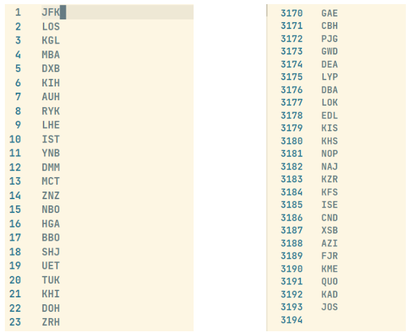
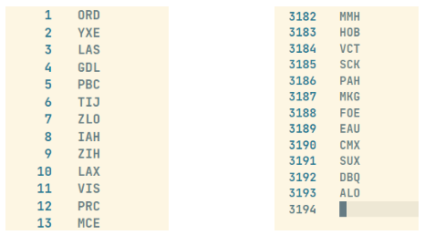
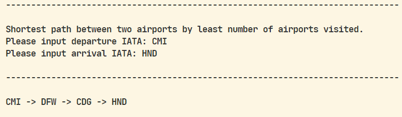
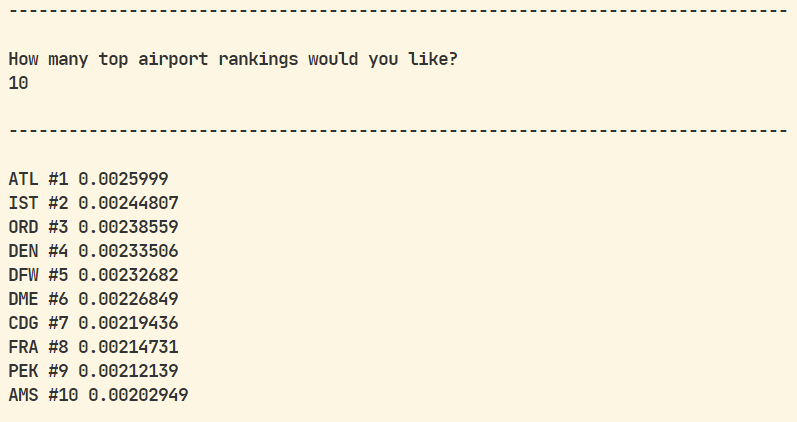

# Project results report (main graph algorithms)

## Depth-First Traversal

The depth-first traversal’s role is to visit every reachable node in the graph exactly once starting from a user-specified point. On our full dataset, if we were to perform a DFS traversal starting at JFK airport, the output is the following 3194 line file:  

  

To verify the correctness of the algorithm, we ran the function again, but this time on another node that was guaranteed to be in the same connected component as JFK: ORD. Our expectations were the output size of a DFS traversal on JFK and a DFS traversal on ORD would be identical. The results were as follows:  

The results were in line with our expectations, and we found it to be sufficient proof of proper performance. Feel free to check out our tests starting at **line 108 in tests/tests.cpp**  

---

## Shortest Path - Airports (BFS)  

When you have chosen to find the shortest path between two airports while minimizing the total number of airports travelled, you will be prompted to input a departure and arrival airport. Given these two, the algorithm finds and outputs the shortest path as shown in the image above.  

In order to test the implementation of our shortest path algorithm, we created a smaller data set. We then mapped out the shortest path between two of our airports minimizing the airports visited. In our algorithm, we return a vector with our airport nodes. We tested to ensure that the expected size of our vector was correct. For example, we expected there two be 4 total visited airports between THU and UAK inclusive and 3 total between GKA and GOH inclusive. We also tested to see if there was no path between two airports that it would output an empty vector by picking two points in our small dataset which had no connection. Also, we manually tested on the large dataset by picking a start point of CMI and end point of JFK. We knew it should only take three total airports because it either can go to DFW or ORD and straight to JFK.  

---

## Shortest Path - Distance (Dijkstra's)  

When you have chosen to find the shortest path between two airports while minimizing the total distance travelled, you will be prompted to input a departure and arrival airport. Given these two, the algorithm finds and outputs the shrotest path as shown in the image above.  

In order to test the implementation of our shortest path algorithm, we looked through our large dataset. We found that CMI can only travel to two airports: ORD and DFW. We knew that if we wanted to travel from CMI to JFK, it should take ORD as a layover to minimize the distance travelled. In our BFS shortest path, it would take DFW to JFK (still 3 airports total). We checked to see if when we chose CMI to JFK that it would be CMI->ORD->JFK rather than CMI->DFW->JFK. We also did more manual tests between airports to see whether or not it was taking the desired route. We printed out total distances for our BFS and Dijkstra’s shortest and compared the distance traveled.  

---

## Get Ranking (PageRank)

When you choose to execute the page rank algorithm, you will simply be asked to enter an integer value for the amount of top airports you want to see. Given this, the program outputs the corresponding amount of airports along with their ranking and page rank weights.  

In order to test our implementation of page rank, we created a smaller data set. We then looked at our nodes and found two (WWK and HGU) that had no incoming nor outgoing edges. Therefore, we expect these two airports to have the same weight, which we tested for. Then, we chose two airports UAK and THU. THU had no incoming edges while UAK had one incoming edge from a fairly popular airport. This clearly means UAK should have a larger pagerank than THU, which we tested for as well. Finally, a sanity check we did was after printing out our page rank results, we looked up the most popular airports, and our rankings relatively lined up with online lists.  